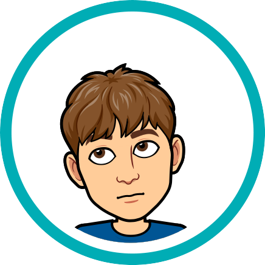

<h1 align="center">Hi there 👋, my name is Vojtěch Perník</h1>
<h3 align="center">FOSS user, developer and translator</h3>

  
  &ensp;
  
  &ensp;
  

 

My name is <strong>Vojtěch Perník</strong> and I'm 15 years old. I&nbsp;like to use a nickname <strong>pervoj</strong>. I&nbsp;am from Czech Republic. My big hobby is programming. I&nbsp; can program in Java, PHP, JavaScript, Python and Vala. I&nbsp;am Linux user.

  
  &ensp;
  
  &ensp;
  
  &ensp;
  

I'm also a freelance translator. I translate open-source projects into Czech. So if you are interested in translating or updating the translation of your application, just let me know.

Here, on my GitHub, you can find all of my projects. I love the vision of open-source software and also all my projects are open-source.

- 🔭 I’m currently working on:
  - [Valdo GTK](https://github.com/pervoj/valdo-gtk) – GTK frontend for [Valdo](https://github.com/Prince781/valdo)
  - [VocaPad](https://github.com/vocapad) – simple and open source vocabulary notebook
  - [Transganizer](https://github.com/transganizer) – organization aplication for translators
- 👯 I’m looking to collaborate on projects that need Czech translation. And also on some simple ones that I can understand and contribute to code.
- 🙂 Pronouns: **he/him**

  
Projects I've translated

  <table>
    <tr>  <th>Original project name</th>  <th>Czech project name</th>  <th>Project homepage</th>  </tr>
    <tr>  <td>Badger</td>  <td>Badger</td>  <td>https://github.com/elfenware/badger</td>  </tr>
    <tr>  <td>Blanket</td>  <td>Deka</td>  <td>https://github.com/rafaelmardojai/blanket</td>  </tr>
    <tr>  <td>Bottles</td>  <td>Láhve</td>  <td>https://github.com/bottlesdevs/Bottles</td>  </tr>
    <tr>  <td>Breathing</td>  <td>Dýchání</td>  <td>https://github.com/SeaDve/Breathing</td>  </tr>
    <tr>  <td>Commit</td>  <td>Commit</td>  <td>https://github.com/sonnyp/Commit</td>  </tr>
    <tr>  <td>Dialect</td>  <td>Dialekt</td>  <td>https://github.com/dialect-app/dialect</td>  </tr>
    <tr>  <td>Drawing</td>  <td>Kreslení</td>  <td>https://github.com/maoschanz/drawing</td>  </tr>
    <tr>  <td>Dynamic Wallpaper Editor</td>  <td>Editor dynamických tapet</td>  <td>https://github.com/maoschanz/dynamic-wallpaper-editor</td>  </tr>
    <tr>  <td>Kooha</td>  <td>Kooha</td>  <td>https://github.com/SeaDve/Kooha</td>  </tr>
    <tr>  <td>Mousai</td>  <td>Mousai</td>  <td>https://github.com/SeaDve/Mousai</td>  </tr>
    <tr>  <td>Share Preview</td>  <td>Náhled sdílení</td>  <td>https://github.com/rafaelmardojai/share-preview</td>  </tr>
    <tr>  <td>Video Downloader</td>  <td>Video Downloader</td>  <td>https://github.com/Unrud/video-downloader</td>  </tr>
    <tr>  <td>Webfont Kit Generator</td>  <td>Generátor webových sad písem</td>  <td>https://github.com/rafaelmardojai/webfont-kit-generator</td>  </tr>
    <!-- <tr>  <td></td>  <td></td>  <td></td>  </tr> -->
  </table>
  
If you find an mistake in any of my translations, let me know at <a href="mailto:translations@pervoj.cz">translations@pervoj.cz</a>.

  
  

